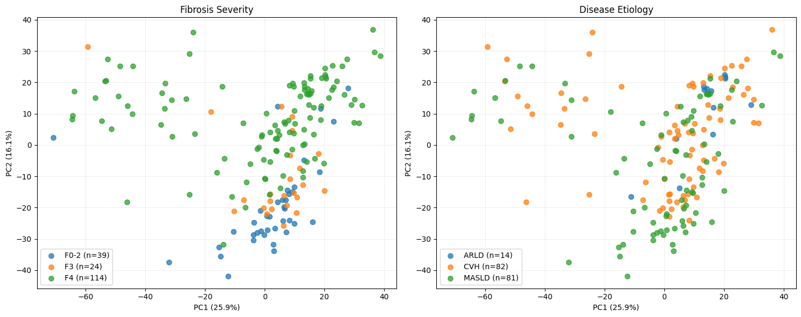
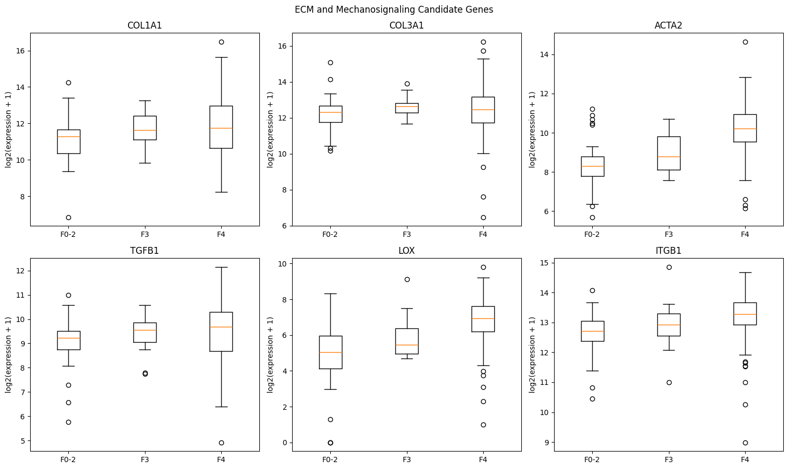
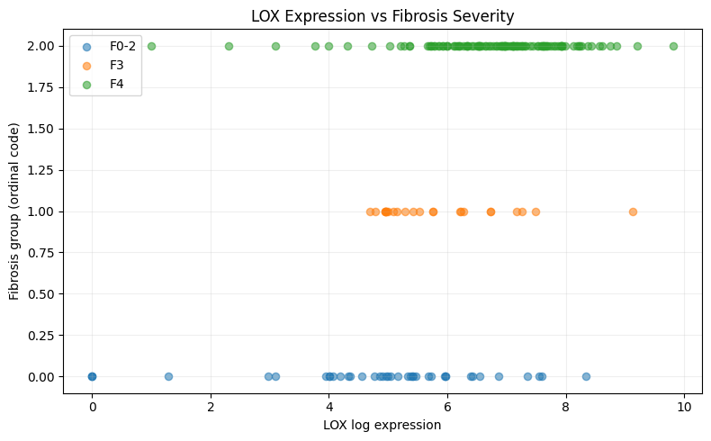
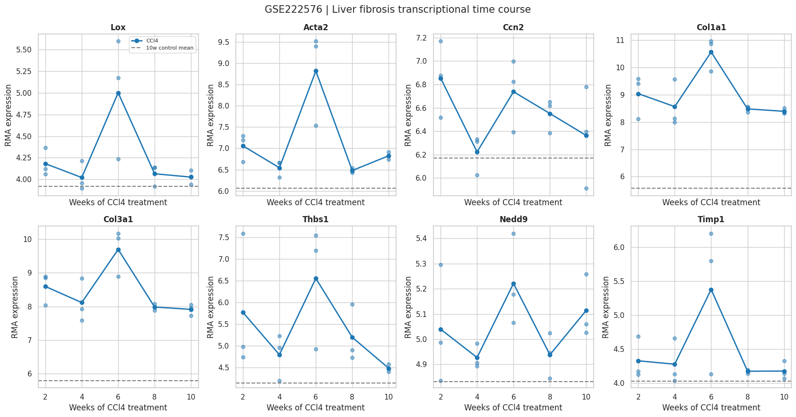
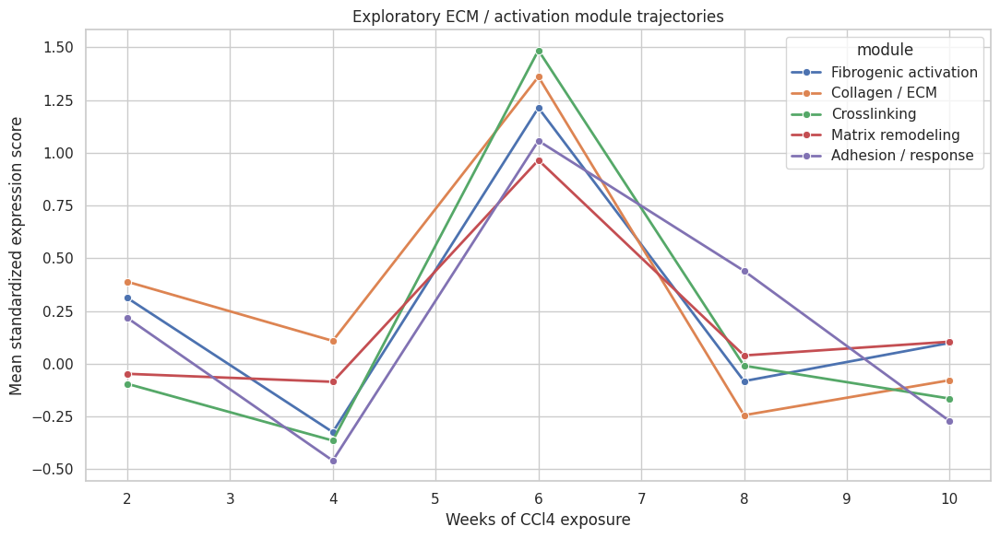

# Liver Fibrosis Systems Biology

### Integrative Transcriptomic Analysis of Liver Fibrosis: ECM Remodeling, Gene Regulation, and Temporal Dynamics

## Overview

Liver fibrosis is characterized by progressive extracellular matrix (ECM) remodeling, excessive collagen deposition, and alterations in tissue architecture. These changes involve interactions between cellular signaling, gene expression, extracellular biochemical reactions, and mechanical properties.

This project investigates fibrosis from a systems biology perspective by integrating human liver transcriptomics with an independent mouse liver-injury time-course dataset.

The central research question is:

**How do fibrosis-associated transcriptional programs relate to ECM remodeling, and could extracellular material dynamics persist beyond changes in cellular gene expression?**

The analysis focuses on fibrogenic activation, collagen regulation, lysyl oxidase (LOX)-associated crosslinking, ECM remodeling, and mechanosignaling.

This is an exploratory computational research project. Its mechanistic hypotheses require experimental validation.

---

## 1. Datasets

Two publicly available Gene Expression Omnibus (GEO) datasets were investigated.

| Dataset | Organism | Samples | Purpose |
|---|---|---:|---|
| [GSE276114](https://www.ncbi.nlm.nih.gov/geo/query/acc.cgi?acc=GSE276114) | Human | 177 | Fibrosis-stage associations |
| [GSE222576](https://www.ncbi.nlm.nih.gov/geo/query/acc.cgi?acc=GSE222576) | Mouse | 18 | Injury-duration transcriptional dynamics |

### Human cohort

The human dataset includes samples representing three fibrosis-stage groups:

| Stage | Samples |
|---|---:|
| F0–F2 | 39 |
| F3 | 24 |
| F4 | 114 |

Disease etiologies included chronic viral hepatitis (CVH; n=82), metabolic dysfunction-associated steatotic liver disease (MASLD; n=81), and alcohol-related liver disease (ARLD; n=14).

The original expression matrix contained 19,983 genes across 177 samples. Following exploratory filtering, 17,790 genes were retained.

### Mouse cohort

The mouse dataset contains CCl4-induced liver-injury groups sampled after 2, 4, 6, 8, and 10 weeks of exposure, with three biological samples per group, alongside three controls collected at week 10.

These are independent animals sampled at different durations, rather than repeated longitudinal measurements of the same mice.

---

## 2. Analytical Workflow

The research used Python-based computational methods.

**Human transcriptomic analysis**

1. Expression-matrix and metadata alignment.
2. Expression quality checks and exploratory log transformation.
3. Principal component analysis (PCA).
4. Gene-wise regression against ordered fibrosis severity, adjusting for disease etiology.
5. Benjamini–Hochberg false discovery rate correction.
6. Examination of selected ECM-associated genes.
7. Exploratory LOX–fibrosis causal-graph modeling using DoWhy.

**Mouse temporal analysis**

1. GEO dataset retrieval and sample annotation.
2. Mouse gene-symbol mapping.
3. Expression analysis across CCl4 exposure durations.
4. Linear temporal trend testing.
5. Week-10 injury-versus-control comparisons.
6. Exploratory ECM-related gene-module trajectories.
7. Directional comparison with human fibrosis-stage associations.

The analyses use NumPy, pandas, SciPy, scikit-learn, statsmodels, Matplotlib, GEOparse, mygene, and DoWhy.

---

## 3. Human Liver Fibrosis Results

### 3.1 Principal Component Analysis

PCA was performed using the 2,000 most variable genes after exploratory expression transformation and standardization.

The first two principal components explained:

- **PC1:** 25.91% of variance.
- **PC2:** 16.13% of variance.

The visualization showed partial organization of samples by fibrosis severity, particularly along PC2, although substantial overlap remained.



*Figure 1. PCA of human liver transcriptomic profiles, colored by fibrosis severity and disease etiology.*

### 3.2 Fibrosis-Associated Gene Expression

An etiology-adjusted regression model was fitted for each gene:

`Gene expression ~ Fibrosis stage + Disease etiology`

Fibrosis stages were encoded as ordered categories (F0–F2 = 0, F3 = 1, F4 = 2).

**7,248 genes were associated with fibrosis stage at FDR < 0.05** under this exploratory model.

Prominent associations included RGCC, FOS, APOLD1, FOSB, AREG, MYC, EGR1, CCN2, NEDD9, THBS1, and ADAMTS1.

Selected ECM-related results:

| Gene | Stage coefficient | Adjusted FDR |
|---|---:|---:|
| ACTA2 | +0.866 | 1.31 × 10⁻¹⁰ |
| LOX | +0.886 | 2.50 × 10⁻⁸ |
| ITGB1 | +0.274 | 0.00178 |
| COL1A1 | +0.199 | 0.278 |
| TGFB1 | +0.077 | 0.590 |
| COL3A1 | +0.017 | 0.922 |

ACTA2, LOX, and ITGB1 showed significant positive associations with ordered fibrosis stage. COL1A1, COL3A1, and TGFB1 did not show significant stage trends under the same adjusted model.



*Figure 2. Expression distributions of six ECM and mechanosignaling candidate genes across human fibrosis-stage groups.*

### 3.3 Exploratory LOX–Fibrosis Modeling

A hypothesized causal graph was constructed to examine the relationship between LOX expression and fibrosis severity while adjusting for disease etiology.

The DoWhy linear-regression estimate was:

- **Adjusted coefficient:** +0.2220
- **p-value:** 7.79 × 10⁻¹⁰
- **Spearman correlation:** 0.5087
- **Spearman p-value:** 4.87 × 10⁻¹³

Exploratory refutation tests included placebo-treatment permutation and the addition of a random common cause.

The placebo estimate approached zero, while the random-common-cause test produced a similar coefficient.

These tests do not establish that LOX causes fibrosis. The analysis remains vulnerable to reverse causation, unmeasured confounding, differences in cell composition, and other observational biases.



*Figure 3. LOX transcript expression plotted against ordinal fibrosis-stage categories.*

---

## 4. Mouse Liver Fibrosis Temporal Analysis

### 4.1 Candidate Gene Trajectories

Twenty selected genes associated with ECM regulation, collagen production, crosslinking, cellular activation, and remodeling were examined across five CCl4 exposure durations.

Several genes, including Acta2, Col1a1, Col3a1, Lox, and Timp1, showed visually elevated expression around week 6.

However, **none of the 20 selected genes demonstrated a statistically significant linear temporal trend after FDR correction**.

The apparent week-6 peaks are descriptive observations and require dedicated nonlinear or categorical-time statistical testing.



*Figure 4. Selected mouse liver gene-expression trajectories across CCl4 exposure durations. Dashed horizontal lines represent week-10 control means.*

### 4.2 Week-10 Injury Versus Control

At week 10, three selected genes showed statistically significant expression differences between CCl4-exposed mice and controls after FDR correction.

| Gene | Injury − control | FDR |
|---|---:|---:|
| Acta2 | +0.768 | 0.00636 |
| Col1a1 | +2.830 | 0.00636 |
| Col3a1 | +2.116 | 0.00366 |

These findings indicate persistent elevation of selected fibrogenic and collagen-related transcripts in injured mice at week 10 relative to controls.

LOX expression did not show a significant linear temporal trend or an FDR-significant week-10 difference.

### 4.3 Exploratory Gene-Module Analysis

Five curated transcriptional modules were examined:

- Fibrogenic activation
- Collagen / ECM
- Crosslinking-associated genes
- Matrix remodeling
- Adhesion / response

The plotted module scores showed a coordinated descriptive elevation around week 6, followed by lower scores at weeks 8 and 10.



*Figure 5. Exploratory standardized expression-module trajectories across mouse liver-injury durations.*

These module scores summarize selected transcript expression and are not direct measurements of collagen crosslinks, enzyme activity, ECM mass, or mechanical stiffness.

---

## 5. Integrated Biological Interpretation

The human dataset identifies transcriptional associations between fibrosis severity and genes involved in fibrogenic activation, matrix regulation, and collagen crosslinking.

The mouse dataset suggests that some of these transcriptional responses may fluctuate across injury durations rather than increase continuously.

Together, these observations motivate an investigation into the distinction between:

**Cellular transcriptional state** and **accumulated extracellular material state**.

Collagen is a structural protein capable of extracellular assembly, enzymatically mediated crosslinking, and degradation. The resulting matrix architecture may persist after a period of elevated transcriptional activity.

This leads to the project's working hypothesis:

> **Fibrotic tissue may exhibit material persistence or material memory, in which accumulated extracellular matrix and its chemical and mechanical properties depend partly on earlier cellular activity, not solely on current gene-expression levels.**

A proposed mechanism is:

`Cell activation → Collagen synthesis → ECM deposition and crosslinking → Altered matrix mechanics → Mechanosignaling → Further cellular responses`

This framework is consistent with established concepts in ECM biology but has **not been directly validated by the present datasets**.

The study did not measure deposited collagen mass, collagen crosslink density, LOX enzymatic activity, tissue stiffness, or mechanical feedback.

---

## 6. Limitations

Several limitations are important when interpreting the results:

1. The human dataset is cross-sectional and cannot establish causal direction.
2. Human fibrosis-stage groups are imbalanced.
3. The gene-wise regression adjusts for disease etiology but not all potential confounders, such as cell composition, batch effects, age, or sex.
4. The original human expression file contains fractional values despite its raw-count filename; the preprocessing and normalization provenance require verification.
5. The ordinal fibrosis-stage model assumes a linear trend across encoded stage groups.
6. Mouse injury duration is not equivalent to human histological fibrosis stage.
7. Mouse sample sizes are small, with three animals per experimental group.
8. The week-6 expression peaks have not undergone dedicated nonlinear significance testing.
9. Gene expression does not directly quantify protein abundance, extracellular enzymatic activity, collagen deposition, or tissue mechanics.
10. The exploratory DoWhy model depends on unverified causal assumptions and does not demonstrate a causal LOX effect.

---

## 7. Future Research

The next phase will investigate the proposed relationship between cellular activity and ECM material dynamics through:

- Nonlinear testing of mouse temporal expression patterns.
- Independent datasets involving fibrosis progression and regression.
- LOX/LOXL perturbation experiments with appropriate controls.
- Quantitative collagen and crosslink measurements.
- ECM stiffness and mechanotransduction measurements.
- Dynamic mathematical models linking cell activation, collagen accumulation, crosslinking, and matrix degradation.
---

## 8. Repository Structure

```text
Liver-Fibrosis-Systems-Biology/
├── README.md
├── requirements.txt
├── LICENSE
├── .gitignore
├── analysis/
│   ├── 01_human_preprocessing_pca.py
│   ├── 02_human_gene_associations.py
│   ├── 03_lox_causal_analysis.py
│   └── 04_mouse_temporal_validation.py
└── results/
    ├── human/
    │   ├── pca_results.csv
    │   ├── fibrosis_gene_associations.csv
    │   ├── ecm_gene_expression.png
    │   ├── pca_analysis.png
    │   └── lox_fibrosis_association.png
    └── mouse/
        ├── gene_time_courses.png
        └── module_trajectories.png
```

## 9. Reproducibility

The analysis scripts were developed for Python and Google Colab.

The human workflow requires the original GSE276114 expression matrix and corresponding sample metadata. The mouse workflow retrieves GSE222576 programmatically.

The analysis scripts should be executed sequentially because later scripts depend on outputs generated by earlier scripts.

For full end-to-end reproduction, the original human expression-processing and metadata preparation procedures must also be documented.

## 10. Research Status

**Status: Exploratory computational investigation**

The project presents transcriptomic associations, cross-species exploratory comparisons, and testable mechanistic hypotheses. It does not claim experimental validation of ECM material memory or LOX-driven fibrosis causality.

## Data Availability

- Human: [GEO GSE276114](https://www.ncbi.nlm.nih.gov/geo/query/acc.cgi?acc=GSE276114)
- Mouse: [GEO GSE222576](https://www.ncbi.nlm.nih.gov/geo/query/acc.cgi?acc=GSE222576)

## License

MIT License. See [LICENSE](LICENSE).
